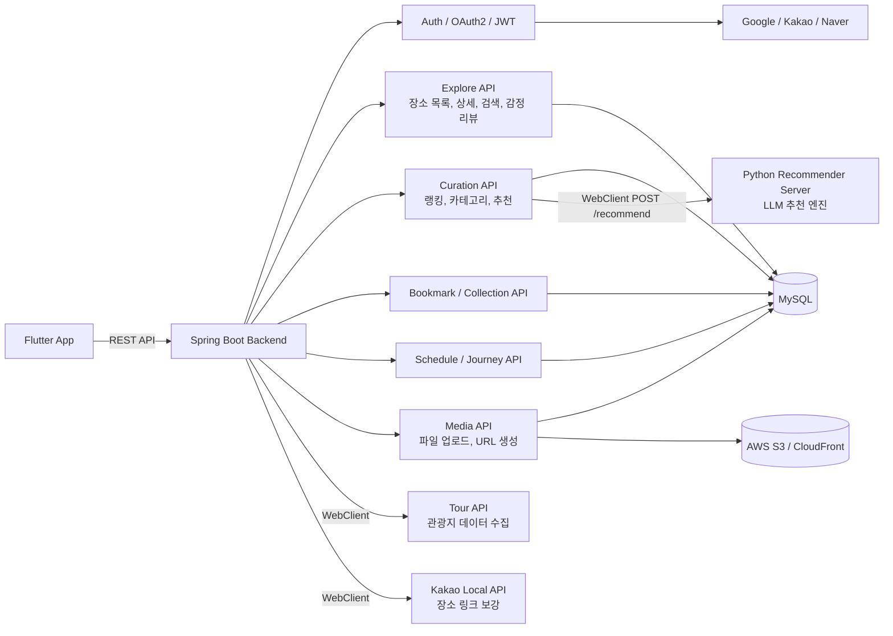

# Heat Trip Backend

감정과 취향 기반으로 여행지를 탐색하고, 추천과 일정 관리까지 연결하는 여행 서비스 백엔드입니다.

[](https://openjdk.org/)
[](https://spring.io/projects/spring-boot)
[](https://www.mysql.com/)
[](https://docs.docker.com/compose/)
[](https://aws.amazon.com/s3/)

## 주요 프로젝트 링크

| 구분 | 역할 | 링크 |
| --- | --- | --- |
| 포트폴리오 | 프로젝트 배경, 문제 정의, 결과물 소개 | [Heat Trip Notion](https://app.notion.com/p/Heat-Trip-321b82bc8b718166a51fd382c51d96b5?source=copy_link) |
| 기술 Wiki | 구현 상세, 테스트 결과, 기술 의사결정 기록 | [GitHub Wiki](https://github.com/sanghyunbang/Heat_Trip_Spring_Boot_BE/wiki) |
| 리팩토링 블로그 | 리팩토링 과정과 학습 기록 | [Heat Trip 프로젝트 리펙토링](https://velog.io/@sanghyunbang/series/Heat-Trip-%ED%94%84%EB%A1%9C%EC%A0%9D%ED%8A%B8-%EB%A6%AC%ED%8E%99%ED%86%A0%EB%A7%81) |

## 관련 리포지토리

| 리포지토리 | 역할 |
| --- | --- |
| [Heat_Trip_Spring_Boot_BE](https://github.com/sanghyunbang/Heat_Trip_Spring_Boot_BE) | Spring Boot 백엔드 API, 인증, 검색, 큐레이션, 일정, 미디어 관리 |
| [heat_trip_flutter](https://github.com/sanghyunbang/heat_trip_flutter) | Flutter 클라이언트 애플리케이션 |
| [heattrip_rec_py](https://github.com/sanghyunbang/heattrip_rec_py) | Python 기반 추천 서버, LLM 추천 엔진 |

## 프로젝트 소개

Heat Trip은 Flutter 클라이언트에서 여행지를 탐색하고, 감정/취향 기반 추천과 일정 관리까지 이어갈 수 있도록 설계한 Spring Boot 백엔드 프로젝트입니다.

백엔드는 Tour API 기반 장소 데이터를 수집하고 정제한 뒤 MySQL에 저장합니다. Flutter 앱은 백엔드 API를 통해 장소 검색, 북마크, 일정, 이미지 업로드 기능을 사용합니다. 추천 기능은 백엔드 내부 점수 계산과 별도 Python recommender 서버 호출을 조합합니다. Spring Boot 서버는 사용자 감정값과 의도 정보를 Python 서버의 `/recommend` API로 전달하고, Python 서버가 반환한 추천 메타데이터를 내부 CAT3 카테고리와 장소 랭킹으로 연결합니다.

이미지 업로드와 미디어 관리는 AWS S3 / CloudFront를 사용하며, OAuth2/JWT 기반 인증과 public 운영을 고려한 rate limit, secret 분리, 에러 응답 정책을 포함합니다.

## 핵심 기능

- 관광지 데이터 수집 및 정제
- 지역, 카테고리, 키워드, 감정 조건 기반 장소 검색
- 장소 특성, 감정 카테고리, Python recommender 응답을 조합한 추천/큐레이션 구조
- 북마크와 컬렉션 기반 장소 저장
- 여행 일정과 여정 관리
- AWS S3 / CloudFront 기반 이미지 업로드와 미디어 관리
- OAuth2 소셜 로그인과 JWT 인증
- rate limit, 에러 응답 정책, secret scan 기반 운영 보호

## 아키텍처 요약



추천 호출 경로는 `CurationController -> CurationRecommendService -> RecommendationPort -> OpenAiRecommendationAdapter -> Python recommender` 입니다. Python 서버 주소는 `LLM_RECOMMENDER_BASE_URL`로 주입하며, 운영에서는 외부 공개 포트가 아니라 Docker 내부 네트워크 통신을 기본으로 둡니다.

이 저장소는 public 전환을 전제로 정리 중입니다. 코드와 예시 설정만 저장소에 두고, 실제 운영 비밀값과 운영 runbook, 배포 상세는 저장소 밖에서 관리하는 구조를 기준으로 합니다.

## 기술 스택

- Java 21
- Spring Boot 3.5.x
- Spring Security / OAuth2 / JWT
- Spring Data JPA
- MySQL
- WebClient / WebFlux
- AWS S3
- Spring AI / OpenAI
- Docker Compose

## 빠른 시작

### 1. 예시 설정 복사

다음 예시 파일을 복사해서 로컬 실행용 설정을 준비합니다.

- `.env.example`

예시:

```bash
cp .env.example .env
```

로컬 개발 실행은 `.env`의 `SPRING_PROFILES_ACTIVE=dev`를 사용합니다. 운영 배포는 서버의 `.env`에서 `SPRING_PROFILES_ACTIVE=prod`로 지정합니다.

### 2. 비밀값 주입

다음 값들은 Git에 커밋하면 안 됩니다.

- DB 비밀번호
- JWT secret
- OAuth client secret
- AWS access key / secret key
- OpenAI API key
- Slack webhook
- Tour API key

### 3. Docker Compose로 실행

```bash
docker compose up -d --build
```

### 4. Gradle로 실행

```bash
SPRING_PROFILES_ACTIVE=dev ./gradlew bootRun
```

Windows 환경:

```powershell
$env:SPRING_PROFILES_ACTIVE="dev"
.\gradlew.bat bootRun
```

## 설정 구조

- 공통 설정: `src/main/resources/application.properties`
- 개발 프로필 설정: `src/main/resources/application-dev.properties`
- 운영 프로필 설정: `src/main/resources/application-prod.properties`
- 테스트 전용 설정: 필요한 테스트에서 `@DataJpaTest(properties = ...)`처럼 개별 지정
- 로컬/런타임 비밀값: `.env`

공통 설정에는 비밀값이 아닌 기본값만 둡니다. 개발/운영 프로필 파일에는 환경별 연결 설정을 두고, 실제 비밀값은 `.env` 또는 서버 환경변수로 주입합니다.

Docker MySQL 초기화 값은 `.env`에 두고, `docker-compose.yml`의 `services.mysql.environment`에서 읽습니다.

- `MYSQL_ROOT_PASSWORD`
- `MYSQL_DATABASE`
- `MYSQL_USER`
- `MYSQL_PASSWORD`

이 값들은 `mysql_data` 볼륨이 처음 생성될 때만 적용됩니다. 이후 `.env`를 수정해도 기존 MySQL 볼륨의 계정이나 비밀번호가 자동으로 변경되지는 않습니다.

LLM recommender base URL 예시:

- Docker 내부 네트워크: `http://recommender:8000`
- 호스트 로컬 접근: `http://127.0.0.1:8000`

## 보안 메모

- 실제 secret 값은 저장소에 두지 않습니다.
- 운영 배포 방식과 내부 운영 문서는 저장소 밖 또는 로컬 전용으로 관리합니다.
- public 저장소에서는 운영용 self-hosted workflow를 제외하는 방향을 권장합니다.

## 자동화

### 비밀값 스캔

GitHub Actions에서 `gitleaks` 기반 secret scan을 실행합니다.

- 워크플로 파일: `.github/workflows/secret-scan.yml`

### 요청 제한

애플리케이션 레벨의 최소 rate limit 보호가 포함되어 있습니다.

- 구현 위치: `src/main/java/com/heattrip/heat_trip_backend/security/ApiRateLimitFilter.java`
- 설정 위치: `src/main/resources/application.properties`, `.env.example`

운영에서는 애플리케이션 내부 제한만으로 끝내지 말고, gateway / WAF / edge 계층의 1차 제한을 같이 두는 편이 안전합니다.

## 문서 관리

- `docs/` 아래에서 역할별로 문서를 관리합니다.
- 운영용 workflow 와 내부 배포 상세는 로컬 전용으로 관리합니다.
