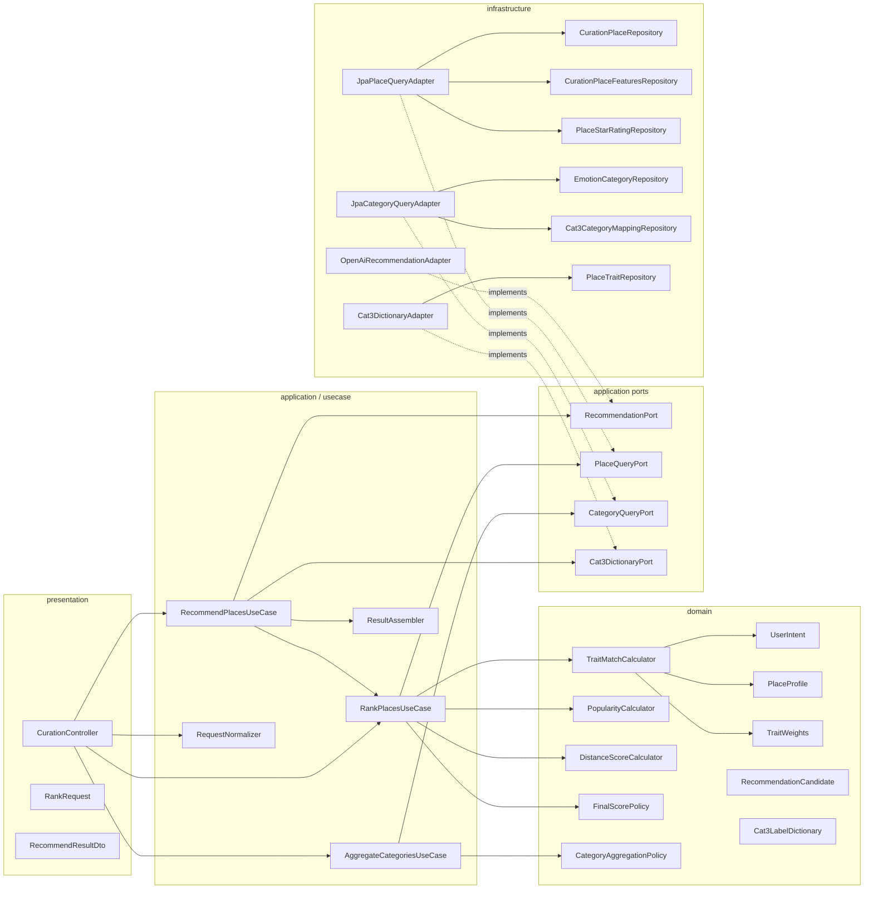
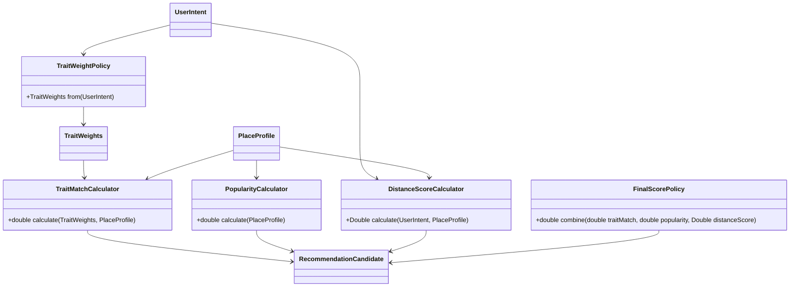

# CURATION 모듈 리팩터링 제안

## 목적

이 문서는 현재 `curation` 모듈의 구조를 더 명확한 책임 분리와 유지보수성을 갖춘 형태로 개선하기 위한 제안서다.

목표는 다음과 같다.

- 추천 규칙을 서비스의 거대한 메서드에서 분리한다.
- 도메인 의미를 DTO와 원시값보다 객체 이름으로 더 드러낸다.
- 외부 연동, 영속성, 계산 규칙, 응답 조합의 경계를 명확히 한다.
- 현재 구조를 한 번에 뒤엎지 않고, 점진적으로 옮길 수 있게 한다.

---

## 현재 구조 요약

현재 구조의 핵심 특징은 아래와 같다.

- `CurationRecommendService`가 추천 전체 흐름을 조정한다.
- `ScoringService`가 사실상 대부분의 추천 규칙을 수행한다.
- 엔티티는 데이터 소스 역할을 하고, 추천 의미는 서비스/DTO 조합에서 생긴다.
- `RecommendationPort`는 잘 분리되어 있지만, persistence와 scoring rule은 강하게 결합되어 있다.

즉, 현재는 `service-centric layered structure`에 가깝다.

---

## 리팩터링 목표

### 1. 책임 분리

현재 `ScoringService`에 몰린 책임을 분리한다.

- 사용자 상태 해석
- 장소 feature 정규화
- trait score 계산
- popularity 계산
- 거리 계산
- 순위 정렬
- 카테고리 집계

### 2. 도메인 의미 강화

추천 엔진의 핵심 개념을 이름 있는 객체로 드러낸다.

- `UserIntent`
- `PlaceProfile`
- `TraitMatch`
- `PopularityScore`
- `DistancePolicy`
- `RecommendationCandidate`

### 3. 경계 명확화

- application/use case: 흐름 조정
- domain: 추천 규칙과 계산
- infrastructure: JPA, WebClient, 외부 LLM
- presentation: API 요청/응답

---

## 제안 구조



---

## 제안 클래스 역할

### application / use case

#### `RecommendPlacesUseCase`

- 입력을 받아 LLM 추천 필요 여부를 결정
- LLM 결과를 category label로 받음
- label을 CAT3 코드로 해석
- `RankPlacesUseCase`를 호출
- 최종 응답용 모델을 조립

#### `RankPlacesUseCase`

- 장소 후보를 읽음
- 각 장소를 `PlaceProfile`로 변환
- 도메인 계산기들을 조합해 최종 점수를 계산
- `RecommendationCandidate` 목록 생성 및 정렬

#### `AggregateCategoriesUseCase`

- 이미 계산된 장소 점수 또는 ranking 결과를 감정 카테고리별로 묶음
- 상위 category summary를 생성

#### `RequestNormalizer`

- `topK`, `distanceWeight`, `maxDistanceKm` 같은 기본값 적용
- 입력 유효성 보정
- 원본 request mutate 없이 정규화된 command 생성

#### `ResultAssembler`

- domain/application 결과를 API DTO로 변환
- `cat3Name`, `firstImageUrl`, LLM meta 같은 표현용 조합 담당

---

## 제안 도메인 객체

### `UserIntent`

현재 `RankRequest` 안의 감정/목표/의도 데이터를 도메인 관점으로 정리한 객체다.

예시 책임:

- PAD 상태 보유
- social need, energy, goals 보유
- scoring에 필요한 의미 있는 접근자 제공

### `PlaceProfile`

현재 `Place`, `PlaceFeatures`, `PlaceStarRating` 집계 정보를 추천 엔진용 하나의 읽기 모델로 모은 객체다.

예시 필드:

- place id, title, cat3
- 위치 좌표
- feature 6축
- confidence 6축
- 리뷰/블로그 수
- 평균 평점
- 대표 이미지

이 객체를 두면 `ScoringService`처럼 여러 엔티티 맵을 동시에 들고 계산할 필요가 줄어든다.

### `RecommendationCandidate`

한 장소 후보에 대한 계산 결과 객체다.

예시 필드:

- `PlaceProfile place`
- `double traitMatch`
- `double popularity`
- `Double distanceScore`
- `double finalScore`

현재의 `PlaceScoreDTO`보다 표현 계층 독립적이어야 한다.

### `TraitWeights`

사용자 상태로부터 계산된 6개 성향 가중치를 담는 값 객체다.

현재 `ScoringService.Weights` 내부 클래스를 외부 의미 있는 객체로 끌어낸 형태다.

### `Cat3LabelDictionary`

현재 `Cat3DictionaryService`가 가진 의미 중심 객체다.

- label -> cat3 codes
- cat3 code -> display name

이 개념을 도메인 혹은 application port 레벨로 승격하면 `PlaceTrait`의 어색한 의미를 코드상 덜 노출할 수 있다.

---

## 제안 계산기 분리



이 구조의 장점은 아래와 같다.

- feature 축 추가 시 영향 범위를 계산기 단위로 좁힐 수 있다.
- popularity 공식 변경이 trait 계산 코드에 영향을 주지 않는다.
- 거리 정책을 실험적으로 교체하기 쉽다.
- 테스트를 작은 단위로 나눌 수 있다.

---

## 현재 클래스와 목표 클래스 매핑

| 현재 | 문제 | 제안 |
|---|---|---|
| `CurationRecommendService` | orchestration + request mutation | `RecommendPlacesUseCase` + immutable normalized request |
| `ScoringService.rank()` | 조회, 계산, 정렬, enrichment 혼재 | `RankPlacesUseCase` + calculators + assembler |
| `ScoringService.categories()` | rank 재사용 + category summary 혼재 | `AggregateCategoriesUseCase` |
| `Cat3DictionaryService` | 사전 로드, 정규화, 표시명 제공 혼재 | `Cat3DictionaryAdapter` + `Cat3LabelDictionary` |
| `PlaceTrait` | 이름과 실제 역할 불일치 | `Cat3LabelEntry` 또는 의미 재정의 |
| `PlaceScoreDTO` | domain result와 API result 경계 불명확 | `RecommendationCandidate` + `PlaceScoreDtoAssembler` |
| `RankRequest` | API DTO가 내부 계산 command로 직접 사용됨 | `NormalizedRankCommand` 또는 `UserIntentCommand` |

---

## 단계별 리팩터링 순서

### Phase 1. 안전한 구조 분리

동작 변화 없이 책임만 분리한다.

1. `RequestNormalizer` 도입
2. `ResultAssembler` 도입
3. `ScoringService` 내부 private 계산 로직을 별도 calculator 클래스로 추출
4. `RankRequest` mutation 제거

이 단계에서는 API 계약과 DB 스키마를 건드리지 않아도 된다.

### Phase 2. 읽기 모델 정리

5. `PlaceProfile` 도입
6. repository 결과를 조합하는 `PlaceQueryPort`와 adapter 도입
7. `ScoringService`를 `RankPlacesUseCase`로 치환

이 단계가 끝나면 계산 로직과 조회 로직이 눈에 띄게 분리된다.

### Phase 3. 의미 정리

8. `PlaceTrait` 의미를 명확히 재정의하거나 이름 변경
9. `Cat3DictionaryService`를 adapter/domain dictionary 구조로 분리
10. `RecommendResultDTO.java`와 `RecommendResultDto.kt` 중복 제거

### Phase 4. 클린 아키텍처 강화

11. category query용 port 분리
12. application/service/domain 패키지 재정렬
13. 계산 정책을 framework-independent domain 객체로 고립

---

## 추천 패키지 구조

```text
curation
├─ presentation
│  └─ CurationController
├─ application
│  ├─ usecase
│  │  ├─ RecommendPlacesUseCase
│  │  ├─ RankPlacesUseCase
│  │  └─ AggregateCategoriesUseCase
│  ├─ port
│  │  ├─ RecommendationPort
│  │  ├─ PlaceQueryPort
│  │  ├─ CategoryQueryPort
│  │  └─ Cat3DictionaryPort
│  └─ assembler
│     └─ ResultAssembler
├─ domain
│  ├─ model
│  │  ├─ UserIntent
│  │  ├─ PlaceProfile
│  │  ├─ RecommendationCandidate
│  │  └─ TraitWeights
│  └─ policy
│     ├─ TraitWeightPolicy
│     ├─ TraitMatchCalculator
│     ├─ PopularityCalculator
│     ├─ DistanceScoreCalculator
│     ├─ FinalScorePolicy
│     └─ CategoryAggregationPolicy
├─ infrastructure
│  ├─ llm
│  │  └─ OpenAiRecommendationAdapter
│  ├─ persistence
│  │  ├─ JpaPlaceQueryAdapter
│  │  ├─ JpaCategoryQueryAdapter
│  │  └─ repositories...
│  └─ dictionary
│     └─ Cat3DictionaryAdapter
└─ dto
   ├─ request
   └─ response
```

---

## 이 제안이 해결하는 문제

### 현재 문제

- `ScoringService` 비대화
- request mutation
- DTO와 domain result 경계 불명확
- dictionary 개념의 이름 혼선
- 정책과 조회가 한 계층에 섞임

### 개선 후 기대 효과

- 책임별 단위 테스트 가능
- 추천 규칙 변경 비용 감소
- 새 scoring policy 실험 용이
- 표현 DTO와 도메인 계산 결과 분리
- 클린 아키텍처에 더 가까운 의존 방향 확보

---

## 현실적인 주의점

이 제안은 구조적으로 더 깔끔하지만, 반드시 한 번에 모두 적용할 필요는 없다.

현재 코드베이스의 크기와 팀 상황을 고려하면 가장 현실적인 시작점은 아래다.

1. `ScoringService` 분해
2. `RankRequest` mutation 제거
3. `PlaceProfile` 도입
4. DTO 중복 제거

즉, 우선은 `service giant class` 문제를 줄이는 것이 가장 효과가 크다.

---

## 결론

현재 `curation` 모듈은 추천 시스템 프로토타입 혹은 실서비스 초기 버전으로는 충분히 실용적이다.
다만 추천 규칙이 계속 늘어나고 실험이 많아질수록 지금 구조는 빠르게 무거워질 가능성이 높다.

따라서 리팩터링 방향은 아래처럼 잡는 것이 적절하다.

- 거대한 서비스 메서드를 작은 정책 객체로 분리
- 엔티티 조합 결과를 `PlaceProfile` 같은 읽기 모델로 수렴
- use case, domain policy, infrastructure adapter의 경계를 분명히 함
- 현재 DTO 중심 의미를 도메인 객체 이름으로 끌어올림

