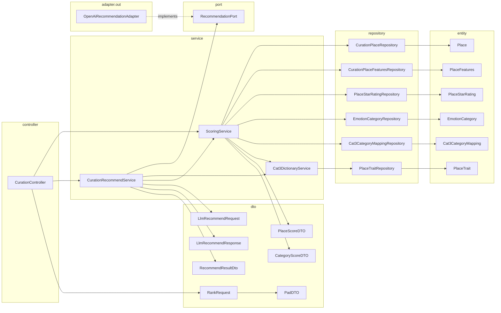
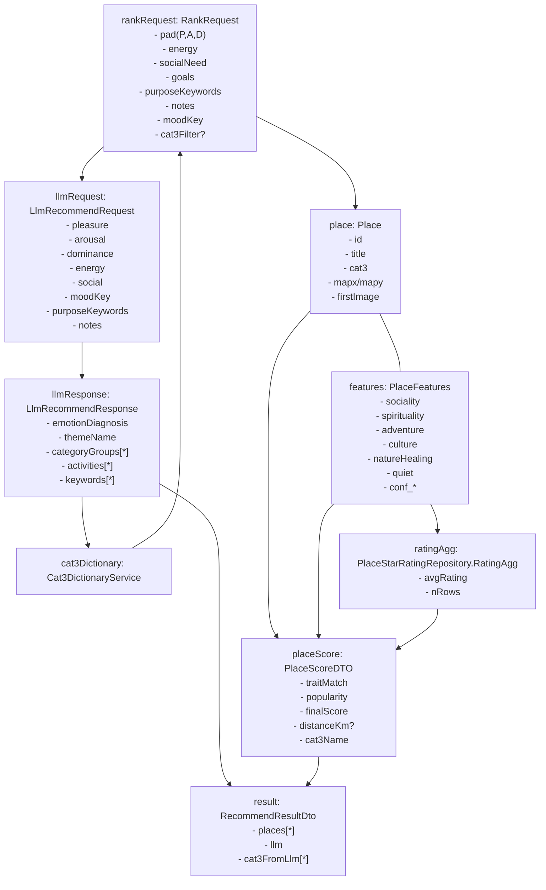
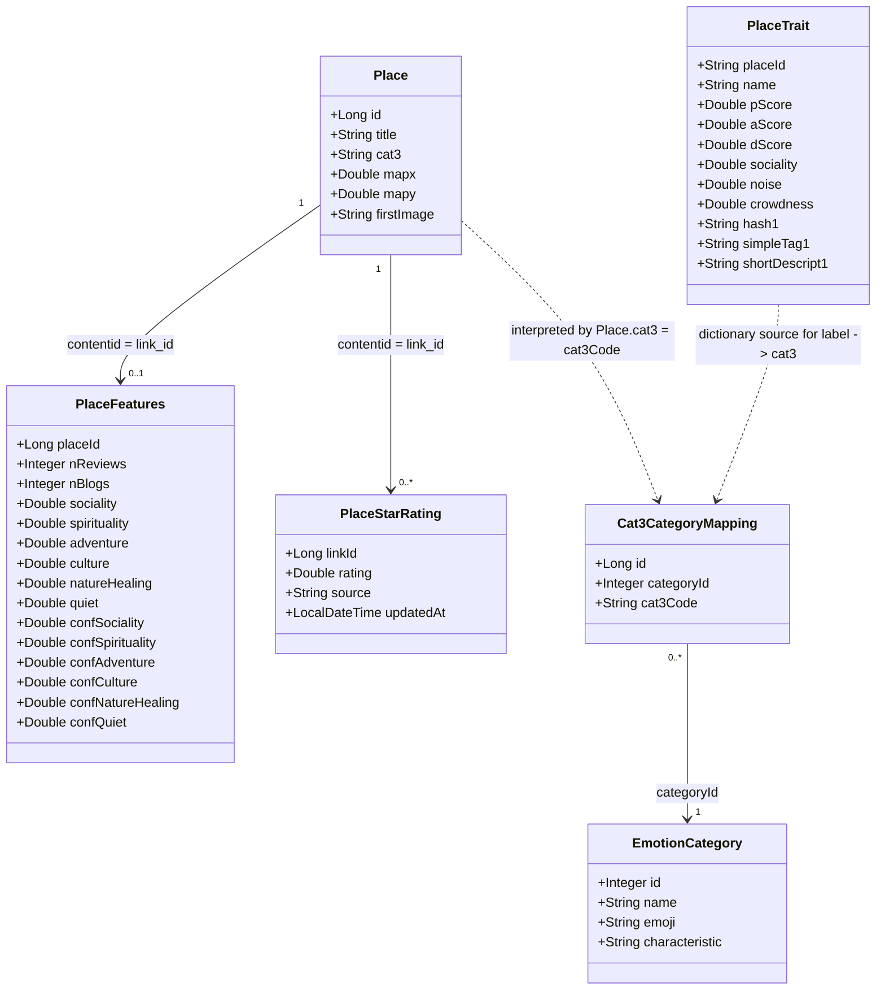
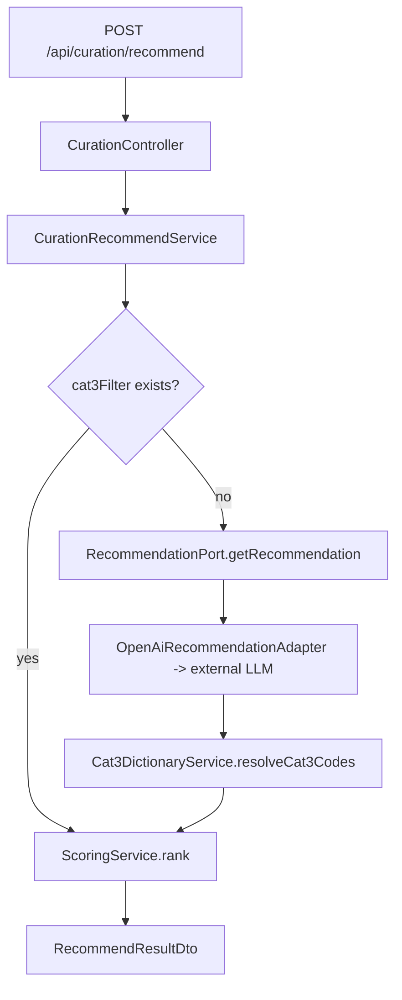

# CURATION 모듈 UML 및 도메인 객체화 정리

## 목적

이 문서는 `curation` 모듈이 현실의 여행/감정/장소 추천 문제를 어떤 객체와 관계로 모델링하는지 정리한다.

- UML 관점에서는 `패키지 다이어그램`과 `객체 다이어그램`을 Mermaid로 기록한다.
- 구현 관점에서는 `엔티티`, `DTO`, `서비스`, `포트/어댑터`가 어떤 책임을 가지는지 설명한다.
- 도메인 관점에서는 "현실의 THINGS를 어떤 객체로 치환했는가"를 별도 표로 정리한다.

주의:

- 이 문서의 Mermaid는 설계 이해를 위한 개념도다.
- 특히 `객체 다이어그램` 파트는 엄밀한 UML object diagram이라기보다 `실행 시점 객체 흐름`을 표현한다.
- 또한 현재 `curation` 모듈은 엄밀한 클린 아키텍처 완성형이 아니라, 포트/어댑터 일부를 적용한 service-centric layered design에 가깝다.

---

## 1. 이 모듈이 다루는 현실 문제

`curation` 모듈은 아래 현실 문제를 다룬다.

1. 사용자의 현재 감정/상태를 입력받는다.
2. 그 상태에 어울리는 여행 테마와 활동 범주를 추론한다.
3. 실제 장소 데이터 중에서 그 테마에 맞는 후보를 좁힌다.
4. 장소별 정량 특성, 평점, 거리 등을 점수화해 최종 추천 순위를 만든다.

즉, 이 모듈은 현실 세계의 복잡한 "여행 추천" 문제를 아래 3층으로 분해한다.

- 사용자 상태 층: `PadDTO`, `RankRequest`
- 장소 지식 층: `Place`, `PlaceFeatures`, `PlaceStarRating`, `PlaceTrait`
- 해석/추천 층: `CurationRecommendService`, `ScoringService`, `RecommendationPort`

---

## 2. 패키지 구조

### 해석

- `controller`는 HTTP 입구다.
- `service`는 추천 orchestration과 점수 계산의 핵심 규칙을 가진다.
- `repository` + `entity`는 장소/감정/매핑 데이터를 읽는 영속성 층이다.
- `port` + `adapter.out`은 외부 LLM 호출을 내부 서비스로부터 분리한다.
- `dto`는 요청/응답과 서비스 간 전달 모델이다.

---

## 3. 패키지 다이어그램 관점의 핵심 설계 의도

### 3.1 `CurationRecommendService`는 오케스트레이터다

이 객체는 직접 점수를 계산하지 않는다.

- 사용자가 `cat3Filter`를 이미 준 경우: LLM 단계를 생략
- 그렇지 않은 경우: LLM에 감정/목적 정보를 보내고 카테고리 후보를 받음
- 받은 카테고리 라벨을 `Cat3DictionaryService`로 CAT3 코드로 변환
- 변환된 CAT3 필터를 `ScoringService`에 넘겨 최종 장소 순위를 계산

즉, 이 서비스는 "추천 흐름의 제어"를 담당한다.

### 3.2 `ScoringService`는 점수 모델의 본체다

이 객체는 실제 추천 품질을 결정하는 수학적 규칙을 가진다.

- 사용자 상태와 목표를 6개 성향 가중치로 변환
- `PlaceFeatures`의 feature/confidence를 정규화
- 평점과 리뷰량을 popularity로 계산
- 거리 옵션이 있으면 거리 점수를 반영
- 최종 점수를 내림차순 정렬해 결과 생성

즉, 이 서비스는 "왜 이 장소가 높은 순위인가"를 결정한다.

### 3.3 `Cat3DictionaryService`는 의미 번역기다

LLM은 사람이 이해하는 카테고리 라벨을 돌려주고, 내부 데이터는 `CAT3` 코드를 기준으로 움직인다.

이 간극을 메우는 객체가 `Cat3DictionaryService`다.

- `PlaceTrait` 테이블과 CSV에서 `(label, cat3)` 사전을 구성
- 라벨 정규화까지 포함해 코드 집합을 역탐색
- 코드로부터 표시용 이름도 제공

즉, 이 서비스는 "사람 언어 ↔ 분류 코드" 변환을 담당한다.

---

## 4. 실행 시점 객체 흐름

Mermaid는 정통 UML object diagram 문법을 충분히 제공하지 않으므로, 여기서는 `실행 시점 인스턴스 관점의 객체 흐름도`로 기록한다.
즉, 아래 그림은 "어떤 인스턴스가 실제로 어떤 객체를 거쳐 결과로 조합되는가"를 설명하는 개념도다.

### 해석

- `RankRequest`는 사용자의 상태와 의도를 담은 요청 객체다.
- `LlmRecommendRequest/Response`는 사람 언어 기반 테마 추론을 담당하는 외부 해석 단계다.
- `Place`, `PlaceFeatures`, `PlaceStarRating`는 한 장소를 서로 다른 관점으로 나눈 데이터 조각이다.
- `PlaceScoreDTO`는 위 조각들을 결합해 생성되는 "평가 결과 객체"다.
- `RecommendResultDto`는 최종 응답 집합이다.

---

## 5. 엔티티 관계

구현상 JPA 연관관계 어노테이션으로 직접 연결되어 있지는 않지만, 실제 데이터 모델 기준의 관계는 아래처럼 읽는 편이 맞다.
단, 아래 다이어그램에는 `직접 스키마 FK 관계`와 `코드값 기반 해석 관계`가 함께 들어 있다.

### 중요한 점

- `Place`와 `PlaceFeatures`는 사실상 1:1 확장 관계다.
- `PlaceStarRating`은 현재 집계해서 쓰기 때문에, 개별 평점 row 자체보다 `평균/건수`가 더 중요한 의미를 가진다.
- `Cat3CategoryMapping`은 장소를 직접 가리키지 않고, 장소의 `cat3` 분류 코드를 통해 간접 연결된다.
- 따라서 `Place ..> Cat3CategoryMapping`은 직접 연관이 아니라 `코드값 기반 해석 관계`다.
- `PlaceTrait`는 일반적인 장소 엔티티라기보다, 현재 코드 기준으로는 `분류 라벨 사전 + 설명 메타데이터`에 가깝다.
- 특히 `PlaceTrait.placeId`는 이름만 보면 place id 같지만, 실제 사용 맥락상 CAT3 코드처럼 해석되고 있어 주의가 필요하다.

---

## 6. 현실의 THINGS를 어떻게 객체화했는가

이 모듈을 이해할 때 가장 중요한 지점은 "현실의 한 대상이 코드에서 하나의 클래스가 아니라 여러 객체로 분해되어 있다"는 점이다.
다만 이 분해는 풍부한 도메인 객체 그래프라기보다, 서비스에서 조합하는 분석형 read model에 가깝다.

| 현실의 Thing | 코드 객체 | 객체화 방식 | 이유 |
|---|---|---|---|
| 사용자의 현재 감정 상태 | `PadDTO`, `RankRequest` | 감정(PAD), 에너지, 사회적 욕구, 목표로 분해 | 추천 입력을 수치화하려고 |
| 추천을 받고 싶은 의도 | `RankRequest.goals`, `purposeKeywords`, `notes` | 구조화된 목표 + 자유 텍스트 혼합 | 규칙 기반 점수와 LLM 해석을 같이 쓰려고 |
| 실제 여행 장소 | `Place` | 최소 식별/표시/좌표/분류 정보만 보유 | 장소 기본 레코드 역할 |
| 장소의 분위기/성향 | `PlaceFeatures` | 사회성, 영성, 모험성, 문화성, 자연치유, 고요함의 6축 점수 | 추천 점수 계산의 핵심 feature 벡터 |
| 장소의 신뢰도/증거량 | `PlaceFeatures.conf_*`, `nReviews`, `nBlogs` | feature confidence와 리뷰량으로 분리 | 값 자체와 값의 신뢰를 구분하려고 |
| 장소의 대중적 평가 | `PlaceStarRating` | 원천 평점을 보관하고 집계해서 사용 | popularity 계산용 |
| 감정 테마 분류 | `EmotionCategory` | 감정 카테고리 메타데이터 | 사용자에게 보여줄 상위 범주 |
| 관광 분류 체계 | `Place.cat3`, `Cat3CategoryMapping` | CAT3 코드와 감정 카테고리의 연결 | 외부 관광 데이터와 내부 감정 추천을 연결 |
| 사람 언어의 카테고리 명칭 | `PlaceTrait`, `Cat3DictionaryService` | 라벨-코드 사전 | LLM이 반환한 자연어를 내부 코드로 바꾸려고 |
| 최종 추천 결과 | `PlaceScoreDTO`, `RecommendResultDto` | 계산 결과와 설명 메타데이터를 묶음 | API 응답 전달용 |

### 해석

이 설계는 현실의 "장소"를 단일 풍부 객체로 만들지 않고, 아래처럼 분산 모델로 다룬다.

- 기본 식별/표시 정보는 `Place`
- 추천 계산 feature는 `PlaceFeatures`
- 대중성 근거는 `PlaceStarRating`
- 분류 체계 연결은 `cat3` + `Cat3CategoryMapping`
- 자연어 라벨 브리지는 `PlaceTrait` + `Cat3DictionaryService`

이 방식의 장점은 계산 책임과 데이터 출처를 분리하기 쉽다는 점이다.
반대로 단점은 한 장소를 이해하려면 여러 객체를 합쳐 읽어야 한다는 점이다.
또한 추천의 의미가 객체 내부보다는 서비스 계산 절차에 더 많이 놓여 있다.

---

## 7. 관계를 어떻게 문서화하면 좋은가

질문한 "THINGS와 관계를 어떻게 문서화할지"에 대해서는 UML만으로는 부족하다.
이 모듈은 코드 관계뿐 아니라 "현실 모델링 의도"가 중요하기 때문이다.

아래 3층으로 병행 문서화하는 방식을 권장한다.

### 7.1 구조 관계

Mermaid 다이어그램으로 문서화한다.

- 패키지 관계: 누가 누구를 호출하는가
- 객체 관계: 실행 시점에 어떤 데이터가 어떤 객체로 변환되는가
- 엔티티 관계: 데이터가 어떤 키로 연결되는가

### 7.2 의미 관계

표로 문서화한다.

권장 포맷:

| Thing | Representation | Owner | Relation | Note |
|---|---|---|---|---|
| 사용자 감정 | `PadDTO` | API 요청 | `RankRequest`에 포함 | 점수 계산의 출발점 |
| 장소 성향 | `PlaceFeatures` | 점수 모델 | `Place`와 `placeId`로 연결 | 실제 추천 quality의 핵심 |
| 카테고리 자연어 라벨 | `PlaceTrait.name` | 사전 서비스 | `Cat3DictionaryService`가 사용 | LLM 결과 해석용 |

이 표는 "코드에 있는 관계"보다 "왜 이 객체가 필요한가"를 드러내는 데 유리하다.

### 7.3 추천 규칙 관계

별도 규칙 문단으로 문서화한다.

예:

- `RankRequest.pad`는 `ScoringService.computeUserWeights()`에서 6개 성향 가중치로 변환된다.
- `PlaceFeatures`의 6개 축은 사용자 가중치와 결합되어 `traitMatch`를 만든다.
- `PlaceStarRating`과 `nReviews/nBlogs`는 `popularity`를 만든다.
- `traitMatch`와 `popularity`는 가중 결합되어 `finalScore`가 된다.

이 층은 클래스 관계가 아니라 "규칙 관계"다. 추천 모듈에서는 이 문서가 특히 중요하다.

---

## 8. 추천 흐름 시퀀스 요약

---

## 9. 코드 해석 시 주의할 점

### 9.1 관계가 객체 참조가 아니라 키 기반이다

`Place`가 `PlaceFeatures`를 필드로 직접 갖지 않는다.
대부분 관계는 JPA association이 아니라 ID/CAT3 코드로 수동 조합된다.

즉, 현재 모델은 "풍부한 도메인 객체 그래프"보다는 "조회 후 조합하는 분석형 모델"에 가깝다.

### 9.2 `PlaceTrait`의 의미는 일반적인 place trait와 다르다

이름만 보면 장소의 세부 성질 엔티티처럼 보이지만, 현재 코드에서 핵심 역할은 `label ↔ CAT3 코드` 사전 로딩이다.
즉, 추천 엔진 내부에서는 사실상 분류 번역용 사전 데이터에 가깝다.

### 9.3 추천의 핵심 객체는 엔티티보다 DTO다

이 모듈에서 실제 의사결정은 `RankRequest`, `LlmRecommendResponse`, `PlaceScoreDTO`, `RecommendResultDto` 주변에서 일어난다.
엔티티는 원재료이고, 추천 의미는 DTO와 서비스 조합에서 발생한다.

### 9.4 현재 구조는 클린 아키텍처 완성형이 아니다

`RecommendationPort`와 `OpenAiRecommendationAdapter` 덕분에 일부 경계 분리는 잘 되어 있다.
하지만 전체적으로는 domain/application/infrastructure가 엄격히 분리된 구조라기보다, 서비스 중심의 레이어드 구조에 더 가깝다.

---

## 10. 다음 문서 확장 후보

이 문서를 기반으로 노션에는 아래 페이지를 분리하면 좋다.

1. `CURATION / 추천 점수 모델`
2. `CURATION / LLM 연동 계약`
3. `CURATION / CAT3 사전과 감정 카테고리 매핑`
4. `CURATION / API 요청-응답 예시`
5. `CURATION / 리팩터링 포인트`

특히 다음 항목은 후속 정리가 가치가 크다.

- `PlaceTrait.placeId`가 실제 place id인지 cat3 코드인지 의미를 명시
- `RecommendResultDTO.java`와 `RecommendResultDto.kt`의 중복 정리 여부
- 엔티티 간 암묵적 관계를 JPA association으로 둘지, 지금처럼 조합형으로 유지할지 결정
