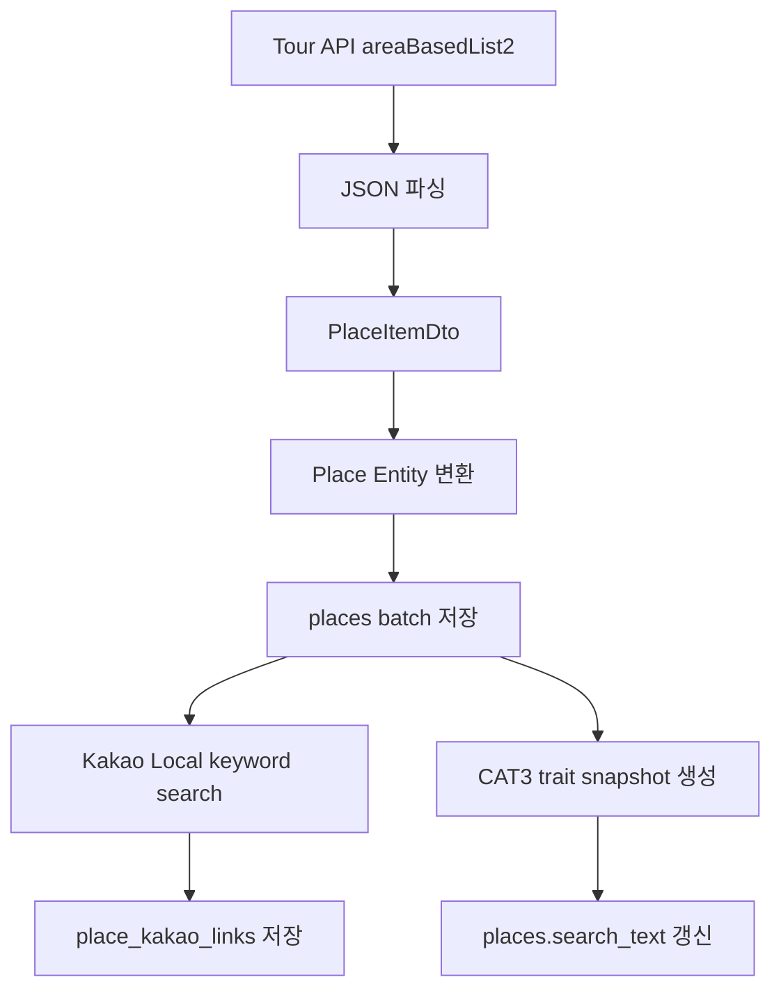

# 외부 API 기반 데이터 파이프라인

> Tour API 기반 장소 데이터를 저장하고, Kakao Local API를 통해 장소 정보를 보강한다. 외부 데이터의 길이, null, 형식 차이를 고려해 저장 전 정제 로직을 적용했으며, 현재 구현은 기본 수집/저장/보강 흐름 중심이다. 운영 수준의 동시성 제어와 실행 이력 관리는 추가 개선이 필요하다.

## 1. 구현 목적

HeatTrip은 자체적으로 장소 데이터를 직접 생성하지 않고, 외부 API에서 수집한 장소 데이터를 기반으로 탐색/추천 기능을 제공한다.

데이터 파이프라인은 크게 다섯 단계로 구성된다.

1. Tour API에서 지역별 장소 데이터 수집
2. 수집한 JSON을 DTO로 파싱
3. DTO를 `Place` 엔티티로 변환하고 DB에 batch 저장
4. Kakao Local API를 통해 장소 URL과 좌표를 보강
5. CAT3 기준으로 장소 trait snapshot과 검색용 `search_text` 재구성



## 2. 주요 코드 위치

라인 번호는 코드 수정 시 쉽게 틀어지므로 문서에서는 클래스와 메서드 중심으로 참조한다.

| 역할 | 코드 |
|---|---|
| Tour API 호출 | `src/main/java/com/heattrip/heat_trip_backend/tour/service/TourApiClient.java` |
| Tour API 수집 orchestration | `src/main/java/com/heattrip/heat_trip_backend/tour/service/PlaceImportService.java` |
| 장소 batch 저장 | `src/main/java/com/heattrip/heat_trip_backend/tour/service/PlaceService.java` |
| Tour DTO to Entity 매핑 | `src/main/java/com/heattrip/heat_trip_backend/tour/mapper/PlaceMapper.java` |
| 장소 엔티티와 저장 전 정제 | `src/main/java/com/heattrip/heat_trip_backend/tour/domain/Place.java` |
| 문자열/전화번호 정제 | `src/main/java/com/heattrip/heat_trip_backend/tour/util/Sanitizers.java` |
| Kakao Local API 호출 | `src/main/java/com/heattrip/heat_trip_backend/kakao/client/KakaoLocalClient.java` |
| Kakao 보강 runner | `src/main/java/com/heattrip/heat_trip_backend/kakao/runner/KakaoLinkBackfillRunner.java` |
| Kakao 보강 로직 | `src/main/java/com/heattrip/heat_trip_backend/kakao/service/KakaoLinkBackfillService.java` |
| Kakao 보강 결과 엔티티 | `src/main/java/com/heattrip/heat_trip_backend/kakao/entity/PlaceKakaoLink.java` |
| CAT3 snapshot 생성 | `src/main/java/com/heattrip/heat_trip_backend/tour/service/TraitSnapshotService.java` |
| `places` repository | `src/main/java/com/heattrip/heat_trip_backend/tour/repository/PlaceRepository.java` |

## 3. Tour API 장소 데이터 수집

Tour API 호출은 `TourApiClient`가 담당한다.

사용 API:

- `/areaBasedList2`
- 지역 코드 `areaCode`
- 페이지 번호 `pageNo`
- 페이지 크기 `numOfRows`
- 응답 형식 `_type=json`

현재 `TourApiClient`는 `tour.service` 패키지에 있지만 역할상 비즈니스 서비스라기보다 외부 API client다. 프로젝트 내 `KakaoLocalClient`가 `kakao.client` 패키지에 있는 것처럼, 향후 `tour.client`로 이동하는 것이 더 자연스럽다.

## 4. 지역별 전체 수집 흐름

`PlaceImportService.fullImportAllAreas()`는 미리 정의한 지역 코드 목록을 순회하면서 Tour API 데이터를 수집한다.

지역 코드:

```java
private static final List<Integer> AREAS =
    List.of(1,2,3,4,5,6,7,8,31,32,33,34,35,36,37,38,39);
```

처리 방식:

- 지역별로 `pageNo=1`부터 시작
- 한 페이지에 `numOfRows=1000`개 요청
- 응답 item이 없으면 종료
- 마지막 페이지는 `items.size() < numOfRows`로 판단
- DTO 변환 후 batch 저장

현재 수집 트리거는 주석 처리된 상태다. `TourFetchScheduler`에는 `@PostConstruct`와 `@Scheduled` 기반 실행 코드가 있으나 모두 주석 처리되어 있고, `PlaceImportController`도 비어 있다. 따라서 현재 애플리케이션 실행만으로 Tour API import가 자동 수행되지는 않는다.

## 5. JSON 파싱과 DTO 변환

Tour API 응답은 `ObjectMapper`로 파싱한다.

```java
JsonNode items = objectMapper.readTree(json)
    .path("response").path("body").path("items").path("item");
```

각 item은 `PlaceItemDto`로 변환한다.

```java
dtos.add(objectMapper.treeToValue(n, PlaceItemDto.class));
```

외부 API 응답을 바로 엔티티로 받지 않고 DTO를 거치는 이유는 외부 응답 구조와 내부 DB 모델을 분리하기 위해서다.

## 6. DTO to Entity 매핑

외부 API 응답 DTO는 `PlaceMapper.toEntity()`에서 `Place` 엔티티로 변환한다.

매핑되는 주요 필드:

- `contentid`
- `title`
- `addr1`, `addr2`
- `zipcode`
- `mapx`, `mapy`
- `firstimage`, `firstimage2`
- `cat1`, `cat2`, `cat3`
- `areacode`, `sigungucode`
- `lDongRegnCd`, `lDongSignguCd`
- `tel`
- `contenttypeid`
- `createdtime`, `modifiedtime`
- `mlevel`

## 7. Batch 저장

장소 데이터는 한 번에 모두 저장하지 않고 batch 단위로 나누어 저장한다.

```java
placeService.saveInBatches(entities, 200);
```

`PlaceService.saveInBatches()`는 지정한 batch size만큼 잘라 `saveAll()` 후 `flush()`를 수행한다.

```java
repo.saveAll(chunk);
repo.flush();
```

`Place.contentid`가 `@Id`이므로 같은 `contentid`가 다시 들어오면 JPA 저장 흐름에서 기존 row 갱신 대상으로 취급될 수 있다. 다만 대량 upsert 성능과 명확한 충돌 정책이 필요하다면 `INSERT ... ON DUPLICATE KEY UPDATE` 같은 native upsert 도입을 검토할 수 있다.

## 8. 외부 데이터 정제

외부 API 데이터는 길이가 DB 컬럼 제한을 넘거나 전화번호 형식이 일정하지 않을 수 있다. 이를 위해 `Place` 엔티티의 `@PrePersist`, `@PreUpdate`에서 저장 전 정제 로직을 실행한다.

정제 대상:

- 전화번호 `tel`
- 장소명 `title`
- 주소 `addr1`, `addr2`
- 우편번호 `zipcode`
- 검색용 텍스트 `searchText`

`Sanitizers`는 문자열 길이 자르기와 전화번호 문자 정제를 담당한다.

- `truncate(String s, int maxLen)`: 문자열 길이 제한
- `cleanTel(String s, int maxLen)`: 전화번호에 허용할 문자만 남기고 공백을 정리한 뒤 길이 제한

`Place`는 저장 전 기본 검색 텍스트도 구성한다.

```java
this.searchText = buildBaseSearchText();
```

이후 CAT3 snapshot 생성 단계에서 `PlaceRepository.refreshAllSearchTexts()`를 통해 trait 설명까지 포함한 검색 텍스트로 다시 갱신한다.

## 9. Kakao Local API 기반 장소 정보 보강

Tour API 데이터만으로는 Kakao 장소 상세 URL이 없으므로, Kakao Local keyword search API를 통해 장소 정보를 보강한다.

Kakao 호출 파라미터:

- `query`: 장소명
- `x`: 경도
- `y`: 위도
- `radius`: 검색 반경
- `size`: 15
- `sort`: `distance` 또는 `accuracy`

`KakaoLocalClient.searchKeyword()`는 Kakao 응답을 `Mono<KakaoKeywordResponse>`로 반환하며, backfill 서비스에서 `.block()`으로 동기 처리한다.

## 10. Kakao Backfill 실행 구조

Kakao 보강은 `KakaoLinkBackfillRunner`를 통해 실행된다. `backfill.kakao.enabled=true`일 때만 실행되도록 `@ConditionalOnProperty`로 구성했다.

`KakaoLinkBackfillService`는 다음 설정을 사용한다.

| 설정 | 설명 |
|---|---|
| `backfill.kakao.only-contentid` | 특정 장소 1건만 보강 |
| `backfill.kakao.sample-size` | 앞에서 N건만 샘플 보강 |
| `backfill.kakao.page-size` | `places` 조회 page size |
| `backfill.kakao.delay-ms` | Kakao API 호출 간 지연 시간 |
| `backfill.kakao.max-distance-m` | Tour 좌표와 Kakao 좌표 간 허용 거리 |

## 11. Kakao 매칭 로직

각 장소에 대해 다음 흐름으로 Kakao 장소 링크를 생성한다.

1. 이미 `place_kakao_links`에 저장된 장소면 skip
2. 장소명이 비어 있으면 URL 없이 row 저장
3. Tour API의 좌표를 기준으로 Kakao keyword search 호출
4. 첫 번째 검색 결과를 후보로 선택
5. Kakao 좌표와 Tour 좌표 간 거리를 계산
6. 허용 거리 이내이면 `placeUrl`, `kakaoMapx`, `kakaoMapy` 저장
7. 허용 거리 밖이면 URL 없이 row 저장

거리 계산은 `GeoUtils.haversineMeters()`에서 Haversine 공식을 사용한다.

예외 발생 시에는 현재 로그만 남기고 skip한다. 실패 row를 저장하는 코드는 `processSafely()` 내부에 주석으로 남아 있으므로, 실패 이력을 DB에서 추적하려면 이 정책을 명확히 정하고 별도 실패 상태 컬럼이나 실행 이력 테이블을 추가하는 것이 좋다.

## 12. Kakao 보강 결과 저장 모델

Kakao 보강 결과는 `place_kakao_links` 테이블에 저장된다.

저장 필드:

- `id`: `places.contentid`
- `title`
- `placeUrl`
- `kakaoMapx`
- `kakaoMapy`
- `created`

매칭 실패나 거리 초과로 유효한 URL을 얻지 못한 경우에도 row가 저장될 수 있다. 이 경우 다음 실행에서 `existsById()` 조건에 의해 같은 장소를 반복 호출하지 않는다. 다만 예외 발생으로 skip된 경우는 현재 row가 저장되지 않는다.

## 13. Kakao 응답 DTO 방어적 매핑

Kakao API 응답은 필요한 필드만 매핑하고, 알 수 없는 필드는 무시한다.

```java
@JsonIgnoreProperties(ignoreUnknown = true)
```

좌표 `x`, `y`는 문자열로 받은 뒤 필요한 시점에 `Double`로 변환한다. 외부 API가 좌표를 문자열로 내려주는 경우 전체 역직렬화 실패를 줄이기 위한 방식이다.

## 14. CAT3 기반 Trait Snapshot 생성

Tour API로 수집된 장소는 `cat3` 카테고리 코드를 가진다. 이 `cat3`를 기준으로 카테고리 설명, 태그, 감정 특성을 묶은 `place_trait_snapshots`를 생성한다.

처리 흐름:

1. 현재 `places`에 존재하는 `cat3` 목록 수집
2. 기존 snapshot 삭제
3. `cat3`별 trait, hashtag, simple tag, description 조회
4. `PlaceTraitSnapshot` 생성
5. snapshot 저장
6. `places.search_text` 재생성

`TraitSnapshotService.rebuildAllSnapshots()`는 마지막 단계에서 `PlaceRepository.refreshAllSearchTexts()`를 호출한다. 이 쿼리는 `places` 전체를 update하므로 데이터가 많아지면 lock 부담이 커질 수 있다.

## 15. 동시성 및 읽기 일관성

현재 구현은 Spring transaction과 DB의 기본 MVCC 동작에 주로 의존한다. 명시적인 import lock, 실행 이력, staging table, snapshot 교체 전략은 아직 없다.

현재 기대할 수 있는 동작:

- 일반적인 MySQL/InnoDB 기준으로 다른 컨트롤러의 `SELECT`가 바로 깨지지는 않는다.
- uncommitted 데이터는 보통 다른 transaction에서 보이지 않는다.
- import 중에도 기존 데이터 조회는 대체로 가능하다.
- 같은 row를 update 중이면 DB가 row lock을 잡을 수 있다.
- 다른 write나 전체 update 작업은 lock 대기 영향을 받을 수 있다.

현재 한계:

- `fullImportAllAreas()` 전체가 하나의 원자적 작업으로 보장되지 않는다.
- 지역/페이지 단위로 저장되므로 사용자는 import 도중 일부는 새 데이터, 일부는 기존 데이터인 상태를 볼 수 있다.
- import 중복 실행 방지 장치가 없다.
- `TourFetchScheduler`와 수동 controller를 동시에 활성화하면 같은 import가 겹쳐 실행될 수 있다.
- `refreshAllSearchTexts()`는 전체 `places`를 update하므로 운영 데이터가 많아질수록 lock 부담이 커질 수 있다.
- 페이지네이션 조회 중 import가 발생하면 total count, 정렬, cursor 결과가 사용자 입장에서 흔들릴 수 있다.

따라서 현재 구현은 개발/소규모 운영 수준의 기본 파이프라인으로 볼 수 있고, 트래픽이 있는 운영 환경에서는 실행 정책과 동시성 제어를 추가하는 것이 좋다.

## 16. 이 구현에서 보여줄 수 있는 기술 포인트

- Tour API 기반 지역별 장소 데이터 수집
- 외부 API JSON 응답을 DTO로 파싱 후 엔티티로 변환
- batch 단위 저장으로 대량 저장 흐름 구성
- 외부 데이터의 길이 초과, null, 전화번호 형식 차이를 저장 전 정제
- Kakao Local API를 이용한 장소 URL/좌표 보강
- 좌표 거리 검증으로 잘못된 Kakao 매칭 결과 필터링
- 조건부 runner를 통한 backfill 실행 제어
- `cat3` 기반 trait snapshot 생성
- snapshot 생성 후 검색용 `search_text` 재구성
- 현재 동시성 한계를 인지하고 개선 항목으로 분리

## 17. 한계와 개선 방향

현재 파이프라인은 기본적인 수집/저장/보강 흐름을 구현한 상태이며, 운영 수준의 데이터 파이프라인으로 보려면 추가 보완이 필요하다.

개선 방향:

- `TourApiClient`를 `tour.service`에서 `tour.client`로 이동
- Tour import 실행 방식을 명확히 결정: scheduler, admin controller, CLI runner 중 선택
- import/backfill 중복 실행 방지: DB lock, advisory lock, ShedLock, 실행 상태 테이블 등
- Tour API 호출 실패 시 retry/backoff 적용
- Kakao API quota 초과 대응
- import/backfill 실행 이력 테이블 추가
- 실패한 row만 재처리하는 retry job 추가
- `saveAll()` + `flush()` 방식 대신 대량 upsert native query 도입 검토
- staging table 적재 후 최종 merge 방식 검토
- `refreshAllSearchTexts()` 전체 update를 batch update로 변경
- 수집 데이터 품질 검증 리포트 추가
- 외부 API 응답 변경에 대비한 contract test 추가

## 18. 리팩토링 Issue 초안

```md
## 목적

외부 API 기반 장소 데이터 파이프라인을 운영 환경에서 더 안전하게 실행할 수 있도록 패키지 구조, 실행 방식, 동시성 제어를 개선한다.

## 작업 항목

- [ ] `TourApiClient`를 `tour.service`에서 `tour.client`로 이동
- [ ] Tour import 실행 방식을 결정한다: scheduler/admin endpoint/runner
- [ ] import 중복 실행 방지 장치를 추가한다
- [ ] import/backfill 실행 이력 테이블을 설계한다
- [ ] 실패 row 재처리 정책을 정의한다
- [ ] Tour API retry/backoff를 적용한다
- [ ] Kakao quota 초과 및 timeout 대응을 추가한다
- [ ] `places` 대량 저장 방식을 native upsert로 개선할지 검토한다
- [ ] `refreshAllSearchTexts()`를 batch update로 변경한다
- [ ] 운영 중 부분 갱신 상태를 허용할지, staging table 기반 교체가 필요한지 결정한다

## 배경

현재 구현은 Spring transaction과 DB 기본 MVCC에 주로 의존한다. 일반 조회가 즉시 깨지는 구조는 아니지만, import 중 부분 갱신 상태 노출, 중복 실행, 전체 update lock 부담은 운영 전 보완이 필요하다.

## 완료 기준

- import가 동시에 두 번 실행되지 않는다.
- 실행 성공/실패 이력을 DB에서 확인할 수 있다.
- 실패한 외부 API 호출을 재처리할 수 있다.
- 대량 update가 읽기 API에 주는 영향을 줄인다.
- 관련 문서가 현재 구조에 맞게 갱신된다.
```
