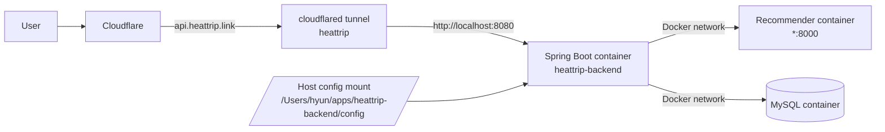

# 20. Mac mini 실운영 확인 결과

- 작성 시각: 2026-03-18
- 상태: 완료
- 목적: 운영 Mac mini에서 실제로 확인한 명령과 결과를 바탕으로 현재 운영 구조를 확정한다.

## 먼저 결론

2026-03-18 기준 현재 운영 구조는 `Cloudflare -> cloudflared -> Spring Boot(Docker)` 이다.

즉:

- `cloudflared`는 사용 중
- `Nginx`는 현재 미설치, 미사용
- Spring Boot 백엔드는 Docker로 실행 중
- 백엔드는 호스트 `127.0.0.1:8080` 으로만 노출
- Cloudflare Tunnel은 `api.heattrip.link` 요청을 `http://localhost:8080` 으로 전달

현재는 public 저장소 전환이 우선이며, Nginx 도입은 TODO로 둔다.

## 현재 아키텍처



## 목표 아키텍처

아래 구조는 아직 적용되지 않았고, 이후 TODO다.


## 실행한 확인 명령과 해석

### 1. cloudflared

실행 명령:

```bash
ps aux | grep cloudflared
cat /opt/homebrew/etc/cloudflared/config.yml
cat ~/.cloudflared/config.yml
```

확인 결과:

- 실행 프로세스:
  - `/opt/homebrew/bin/cloudflared --config /opt/homebrew/etc/cloudflared/config.yml tunnel run heattrip`
- 실제 설정 파일:
  - `/opt/homebrew/etc/cloudflared/config.yml`
- 동일 내용의 사용자 설정 파일:
  - `/Users/hyun/.cloudflared/config.yml`
- 확인된 실제값:
  - `tunnel: heattrip`
  - `credentials-file: /Users/hyun/.cloudflared/24b2ef97-38ea-4c2d-9af4-ee6c794a8971.json`
  - `hostname: api.heattrip.link`
  - `service: http://localhost:8080`

해석:

- Cloudflare Tunnel은 현재 Nginx가 아니라 Spring Boot 쪽 `localhost:8080` 으로 직접 전달한다.
- 실제 public 도메인은 `api.heattrip.link` 이다.

### 2. Nginx

실행 명령:

```bash
ps aux | grep nginx
which nginx
nginx -v
```

확인 결과:

- Nginx 프로세스 없음
- `nginx not found`
- `zsh: command not found: nginx`

해석:

- 현재 운영에는 Nginx가 없다.
- 기존 Nginx 문서는 현재 상태가 아니라 향후 목표 구조 문서로 봐야 한다.

### 3. Docker / 앱 / DB

실행 명령:

```bash
docker ps
cat /Users/hyun/apps/heattrip-backend/docker-compose.yml
docker inspect heattrip-backend
docker inspect heattrip-backend-recommender-1
docker inspect heattrip-mysql
lsof -i -P -n | grep LISTEN
```

확인 결과:

- 운영 compose 경로:
  - `/Users/hyun/apps/heattrip-backend/docker-compose.yml`
- 실행 중 컨테이너:
  - `heattrip-backend`
  - `heattrip-backend-recommender-1`
  - `heattrip-mysql`
- 백엔드 publish:
  - `127.0.0.1:8080:8080`
- MySQL publish:
  - `127.0.0.1:3306:3306`
- recommender publish:
  - `8000:8000`
- listen 상태:
  - `127.0.0.1:8080`
  - `127.0.0.1:3306`
  - `*:8000`

해석:

- Spring Boot는 외부 직접 공개가 아니라 호스트 loopback 에만 열려 있다.
- MySQL도 loopback 에만 열려 있다.
- recommender 는 `*:8000` 으로 열려 있어 외부 접근 가능성이 있다.

### 4. 운영 설정 파일

실행 명령:

```bash
find ~ -name "application-private.properties" 2>/dev/null
find ~ -type d -name "config" 2>/dev/null
```

확인 결과:

- 실제 운영 private config 후보:
  - `/Users/hyun/apps/heattrip-backend/config/application-private.properties`
- compose bind mount:
  - `/Users/hyun/apps/heattrip-backend/config:/config`

해석:

- 운영 private 설정은 저장소 밖 host 디렉터리에서 컨테이너 `/config` 로 주입되는 구조다.

## 실제값 표

| 항목 | 실제값 |
|------|--------|
| public domain | `api.heattrip.link` |
| cloudflared config path | `/opt/homebrew/etc/cloudflared/config.yml` |
| tunnel name | `heattrip` |
| tunnel credentials path | `/Users/hyun/.cloudflared/24b2ef97-38ea-4c2d-9af4-ee6c794a8971.json` |
| cloudflared service target | `http://localhost:8080` |
| nginx config path | 없음 |
| nginx listen port | 없음 |
| nginx server_name | 없음 |
| nginx upstream target | 없음 |
| spring boot listen port | host `127.0.0.1:8080`, container `0.0.0.0:8080` |
| docker compose path | `/Users/hyun/apps/heattrip-backend/docker-compose.yml` |
| private config dir | `/Users/hyun/apps/heattrip-backend/config` |
| application-private.properties path | `/Users/hyun/apps/heattrip-backend/config/application-private.properties` |

## public 전환 관점의 핵심 판단

### 확정된 것

- 운영 경로는 이미 `Cloudflare -> cloudflared -> backend direct` 로 돌아간다.
- 따라서 public 저장소 전환을 위해 Nginx를 지금 당장 먼저 넣을 필요는 없다.
- public 전환 문서는 현재 구조를 기준으로 먼저 정리하는 것이 맞다.

### 남아 있는 TODO

1. 운영 compose 에 남아 있는 평문 secret 제거
2. `recommender` 의 외부 바인딩 제거 또는 의도 재확인
3. MySQL healthcheck 계정/비밀번호 불일치 수정
4. 필요 시 Nginx 를 별도 단계로 도입

## 주의할 점

- 이 문서에는 실제 비밀번호나 토큰을 적지 않는다.
- 운영 compose 에 실제 secret 이 남아 있는 사실만 기록하고 값은 문서화하지 않는다.
- public 저장소 전환 전에는 운영 compose 자체도 secret 분리 기준에 맞게 다시 정리해야 한다.

## 관련 문서

- [5_current_status.md](5_current_status.md)
- [15_public_launch_runbook.md](15_public_launch_runbook.md)
- [17_operating_machine_discovery_checklist.md](17_operating_machine_discovery_checklist.md)
- [18_public_release_final_checklist.md](18_public_release_final_checklist.md)
- [19_mac_mini_command_checklist.md](19_mac_mini_command_checklist.md)
