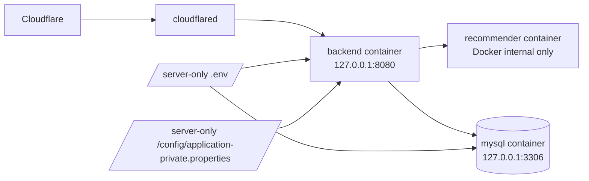

# 21. 운영 secret 분리 및 recommender 노출 정리

- 작성 시각: 2026-03-19
- 상태: 완료
- 목적: 현재 운영 Mac mini 기준으로, public 저장소 전환 전에 꼭 정리해야 하는 두 가지를 실행 가능한 형태로 정리한다.

## 먼저 결론

지금 당장 우선해야 하는 운영 정리는 아래 두 가지다.

1. 운영 compose 에 남아 있는 평문 secret 을 저장소 밖 `.env` 와 `/config/application-private.properties` 로 분리
2. `recommender` 의 `*:8000` host publish 를 제거해서 외부 노출 가능성 차단

이 문서는 `문서만 설명` 하는 것이 아니라, 운영 Mac mini 에서 어떤 방향으로 실제 설정을 바꿔야 하는지까지 포함한다.

## 왜 지금 이 두 가지가 우선인가

2026-03-18 실측 결과:

- backend 는 `127.0.0.1:8080` 만 열려 있어 비교적 안전
- mysql 은 `127.0.0.1:3306` 만 열려 있어 비교적 안전
- recommender 는 `*:8000` 으로 열려 있음
- 운영 compose 에 MySQL 비밀번호가 평문으로 남아 있음

즉, public 저장소 전환 전에 가장 먼저 줄여야 할 리스크는:

- 저장소나 운영 파일에 남아 있는 평문 secret
- 불필요한 host-level 포트 노출

실측 근거는 [20_mac_mini_actual_state_2026_03_18.md](20_mac_mini_actual_state_2026_03_18.md) 를 본다.

## 목표 상태



핵심:

- backend 는 host loopback 으로만 유지
- mysql 도 host loopback 으로만 유지
- recommender 는 host port 를 열지 않고 Docker network 내부 통신만 사용
- DB/OAuth/JWT/API key 는 모두 저장소 밖 파일로만 주입

## 1. secret 분리 원칙

### 저장소 밖으로 빼야 하는 것

- MySQL root password
- MySQL app password
- JWT secret
- OAuth client secret
- AWS access key / secret key
- Kakao / Tour / OpenAI / Slack secret

### 저장소 안에 남겨도 되는 것

- `.env.example`
- `application-private.properties.example`
- placeholder 만 들어 있는 compose 예시
- 절차 문서

## 2. recommender 포트 정리 원칙

현재 운영 compose 는 `recommender` 에 host publish 가 있다.

문제:

- `8000:8000` 은 호스트 전체 인터페이스에 노출될 수 있다.
- backend 는 같은 Docker network 에서 서비스명 `recommender:8000` 으로 접근 가능하므로, host publish 가 필수는 아니다.

권장:

- `recommender` 의 `ports:` 를 제거

차선:

- 정말 host 에서 직접 점검이 필요하면 `127.0.0.1:8000:8000`

## 3. 운영 compose 변경 방향

### 현재 문제점

- MySQL secret 이 compose 파일에 직접 들어 있음
- healthcheck 계정/비밀번호가 실제 환경변수와 불일치
- recommender 가 `*:8000` 으로 열려 있음

### 권장 변경 후 형태

```yaml
services:
  app:
    build: .
    container_name: heattrip-backend
    environment:
      - SERVER_ADDRESS=0.0.0.0
      - LLM_RECOMMENDER_BASE_URL=${LLM_RECOMMENDER_BASE_URL:-http://recommender:8000}
    ports:
      - "127.0.0.1:8080:8080"
    depends_on:
      - mysql
      - recommender
    volumes:
      - /Users/hyun/apps/heattrip-backend/config:/config
    restart: unless-stopped

  recommender:
    build:
      context: ../heattrip_rec_py
      dockerfile: Dockerfile
    restart: always

  mysql:
    image: mysql:8.0
    container_name: heattrip-mysql
    environment:
      MYSQL_ROOT_PASSWORD: ${MYSQL_ROOT_PASSWORD}
      MYSQL_DATABASE: ${MYSQL_DATABASE:-heat_trip_db}
      MYSQL_USER: ${MYSQL_USER}
      MYSQL_PASSWORD: ${MYSQL_PASSWORD}
    ports:
      - "127.0.0.1:3306:3306"
    healthcheck:
      test: ["CMD-SHELL", "mysqladmin ping -h localhost -u$$MYSQL_USER -p$$MYSQL_PASSWORD || exit 1"]
    restart: unless-stopped
```

## 4. 운영 서버에서 실제로 할 일

작업 대상:

- `/Users/hyun/apps/heattrip-backend/docker-compose.yml`
- `/Users/hyun/apps/heattrip-backend/.env`
- `/Users/hyun/apps/heattrip-backend/config/application-private.properties`

순서:

1. 현재 compose 백업
2. `.env` 에 MySQL 비밀번호와 필요한 운영 환경변수 정리
3. compose 에서 평문 secret 제거
4. `recommender` 의 `ports:` 제거
5. `docker compose config` 로 결과 확인
6. `docker compose up -d` 로 재기동
7. `docker ps` 와 `lsof -i -P -n | grep LISTEN` 으로 `*:8000` 제거 확인

## 5. 운영 서버용 점검 명령

```bash
cp /Users/hyun/apps/heattrip-backend/docker-compose.yml /Users/hyun/apps/heattrip-backend/docker-compose.yml.bak
cat /Users/hyun/apps/heattrip-backend/.env
docker compose -f /Users/hyun/apps/heattrip-backend/docker-compose.yml config
docker compose -f /Users/hyun/apps/heattrip-backend/docker-compose.yml up -d
docker ps
lsof -i -P -n | grep LISTEN
docker logs --tail 100 heattrip-backend
docker logs --tail 100 heattrip-backend-recommender-1
```

작업 후 기대 결과:

- `127.0.0.1:8080` 유지
- `127.0.0.1:3306` 유지
- `*:8000` 또는 `0.0.0.0:8000` 사라짐
- backend 로그에서 recommender 호출 대상이 `http://recommender:8000` 또는 의도한 내부 주소로 보임

## 6. 저장소 기준으로 지금 반영해야 하는 것

public 저장소 전환 기준으로는 아래를 반영하는 것이 맞다.

1. `.env.example` 에 `LLM_RECOMMENDER_BASE_URL` 예시 추가
2. 예시 문서에 recommender 는 내부 Docker network 통신이 기본임을 명시
3. secret 분리와 `*:8000` 제거 절차 문서를 저장소에 추가

## 7. 지금 하지 않는 것

- Nginx 도입
- Cloudflare Tunnel 구조 변경
- 운영 비밀번호나 토큰의 실제값 문서화

이 항목들은 현재 우선순위가 아니다.

## 관련 문서

- [20_mac_mini_actual_state_2026_03_18.md](20_mac_mini_actual_state_2026_03_18.md)
- [15_public_launch_runbook.md](15_public_launch_runbook.md)
- [18_public_release_final_checklist.md](18_public_release_final_checklist.md)
