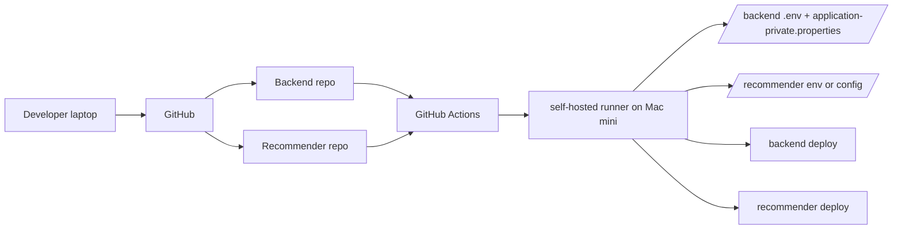

# 23. Backend / Recommender CI/CD 설계서

- 작성 시각: 2026-03-19
- 상태: 완료
- 목적: backend 와 recommender 가 separate repo 인 현재 구조를 기준으로, 비용 우선의 현실적인 CI/CD 설계를 정리한다.

## 먼저 결론

backend 와 recommender 는 `같은 저장소에서 함께 배포` 하는 것이 아니라, `각자 separate repo 에서 별도 workflow 로 배포` 하는 것이 맞다.

다만 아래는 공유할 수 있다.

- 같은 Mac mini 운영 서버
- 같은 self-hosted runner
- 같은 Docker Compose 기반 운영 철학
- 같은 secret 주입 방식

즉, "함께 배포" 가 아니라 `같은 배포 패턴을 공유` 한다는 의미다.

## 설계 목표

- 노트북에서 push 하면 운영 서버가 자동 반영된다
- 운영 secret 은 저장소에 커밋하지 않는다
- backend 와 recommender 는 separate repo 를 유지한다
- 비용이 거의 들지 않는다
- 나중에 AWS SSM 으로 옮길 수 있게 구조를 단순하게 유지한다

## 전체 구조



## 핵심 원칙

### 1. repo 는 분리

- backend 변경은 backend repo 가 책임진다
- recommender 변경은 recommender repo 가 책임진다

### 2. runner 는 공유 가능

- 같은 Mac mini 에 self-hosted runner 하나를 두고
- 두 repo 가 같은 runner label 을 사용할 수 있다

즉, runner 공유와 repo 통합은 전혀 다른 문제다.

### 3. secret 은 repo 안에 두지 않음

- GitHub Secrets 에 저장
- workflow 가 배포 시 서버 파일로 생성

### 4. compose 또는 서비스 restart 는 각 repo 책임 범위에 맞게 수행

- backend repo workflow 는 backend 관련 서비스만 반영
- recommender repo workflow 는 recommender 관련 서비스만 반영

## backend 배포 설계

### 저장해야 할 secret 예시

- `PROD_MYSQL_ROOT_PASSWORD`
- `PROD_MYSQL_PASSWORD`
- `PROD_JWT_SECRET`
- `PROD_GOOGLE_CLIENT_ID`
- `PROD_GOOGLE_CLIENT_SECRET`
- `PROD_KAKAO_CLIENT_ID`
- `PROD_KAKAO_CLIENT_SECRET`
- `PROD_NAVER_CLIENT_ID`
- `PROD_NAVER_CLIENT_SECRET`
- `PROD_KAKAO_REST_KEY`
- `PROD_TOUR_API_SECRET`
- `PROD_AWS_ACCESS_KEY`
- `PROD_AWS_SECRET_KEY`
- `PROD_S3_BUCKET`
- `PROD_CLOUDFRONT_DOMAIN`
- `PROD_OPENAI_API_KEY`
- `PROD_OPENAI_MODEL`
- `PROD_SLACK_WEBHOOK_URL`

### backend workflow 동작

1. backend repo push
2. self-hosted runner 에 checkout
3. backend 배포 디렉터리에 코드 반영
4. `.env` 생성
5. `config/application-private.properties` 생성
6. `docker compose config` 검증
7. `docker compose up -d --build`
8. 로그/헬스체크 확인

### backend 용 파일 생성 구조

`.env`

- DB 계정 정보
- 보안 관련 env
- 로그/운영 관련 env
- `LLM_RECOMMENDER_BASE_URL=http://recommender:8000`

`application-private.properties`

- datasource URL/username/password
- JWT secret
- OAuth client id/secret
- Kakao/Tour/AWS/OpenAI/Slack 관련 secret

## recommender 배포 설계

### recommender 가 separate repo 일 때의 원칙

- recommender repo 는 recommender 만 배포한다
- backend repo 의 workflow 가 recommender 코드를 직접 관리하지 않는다

### recommender secret 예시

실제 recommender repo 에 따라 달라지겠지만 보통:

- OpenAI API key 또는 다른 LLM key
- tracing/observability key
- model 설정
- timeout, provider 설정

### recommender workflow 동작

1. recommender repo push
2. self-hosted runner 에 checkout
3. recommender deploy 디렉터리 반영
4. 필요한 env 생성
5. recommender 이미지 build/restart
6. backend 와의 내부 연결 점검

## runner 공유의 의미

runner 공유는 아래 뜻이다.

- backend repo 와 recommender repo 가 같은 Mac mini runner 를 사용 가능
- 같은 머신에서 각자 자기 workflow 를 실행 가능

runner 공유가 뜻하지 않는 것:

- 같은 repo 로 합친다
- 항상 동시에 배포한다
- 하나의 workflow 에 모두 몰아넣는다

즉, `인프라는 공유`, `배포 책임은 분리` 가 맞다.

## 배포 디렉터리 구조 예시

Mac mini 안에서 아래처럼 분리하는 것을 권장한다.

```text
/Users/hyun/apps/heattrip-backend
/Users/hyun/apps/heattrip-backend/config
/Users/hyun/apps/heattrip-recommender
/Users/hyun/apps/heattrip-recommender/config
```

backend 와 recommender 가 서로 다른 repo 라면, 작업 디렉터리도 분리하는 편이 안전하다.

## 권장 workflow 방향

### backend repo

- trigger:
  - `push` on `main`
  - `workflow_dispatch`
- runs-on:
  - `[self-hosted, macOS, X64]` 또는 현재 runner label 에 맞는 값
- 핵심 단계:
  - checkout
  - deploy dir sync
  - secret 파일 생성
  - compose validate
  - compose up
  - health/log check

### recommender repo

- trigger:
  - `push` on `main`
  - `workflow_dispatch`
- runs-on:
  - 같은 runner label 사용 가능
- 핵심 단계:
  - checkout
  - deploy dir sync
  - env 생성
  - container rebuild/restart
  - health/log check

## 현재 저장소 기준 후속 작업

backend 저장소에서는 다음이 필요하다.

1. `deploy-backend.yml` 을 수동 파일 의존형에서 secret 생성형으로 변경
2. 운영 경로와 파일 생성 경로를 문서화
3. `.env`, `application-private.properties` 생성 정책을 public 문서에 맞게 정리

recommender 저장소에서는 다음이 필요하다.

1. self-hosted runner 배포 workflow 추가
2. env 생성 방식 확정
3. host publish 없이 내부 네트워크 통신 구조 유지

## 장기 확장 포인트

지금 설계는 추후 아래로 옮기기 쉽도록 유지한다.

- GitHub Secrets -> AWS SSM Parameter Store
- runner 파일 생성 -> SSM 조회 후 파일 생성
- 단일 서버 -> 환경별 분리

즉, 지금은 단순하게 가되 나중에 외부 secret 저장소로 이전 가능한 형태를 유지하는 것이 핵심이다.

## 관련 문서

- [22_cicd_option_review.md](22_cicd_option_review.md)
- [20_mac_mini_actual_state_2026_03_18.md](20_mac_mini_actual_state_2026_03_18.md)
- [21_secret_separation_and_recommender_hardening.md](21_secret_separation_and_recommender_hardening.md)
